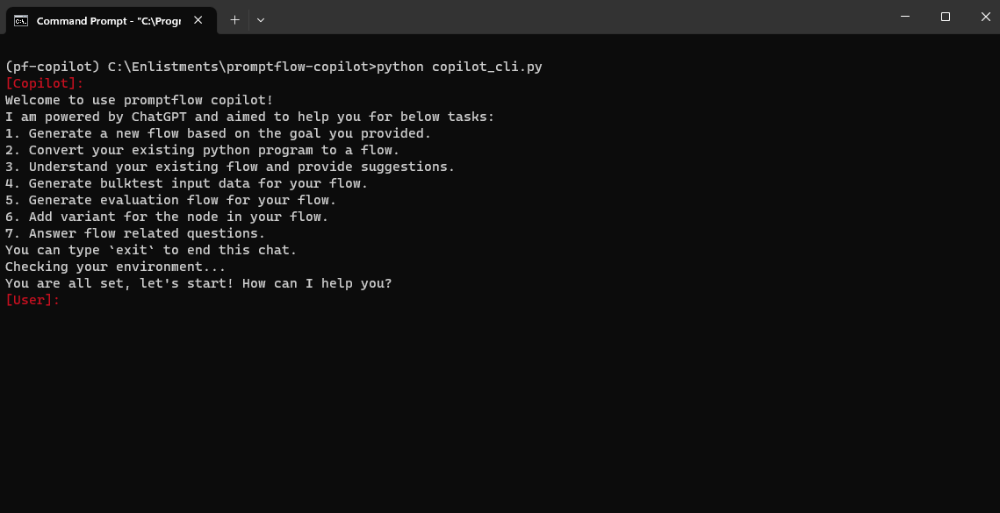

# Promptflow Copilot

An intelligent copilot designed for promptflow

## Objective

The Promptflow Copilot is an intelligent assistant built on the ChatGPT platform, designed to interactively assist Promptflow users with:

- Automatically generating promptflow to accomplish the given goal [Done]
- Understanding users' pre-existing code and converting it into promptflow [Done]
- Assisting users in generating bulk test input data [Done]
- Assisting users in creating an evaluation flow [Done]
- Comprehending existing promptflow [Done]
- Assisting users in adding variations for llm node [Done]

## How to use

- From root folder, install the requirements using
```bash
pip install -r requirements.txt
```

- Create a pfcopilot.env file in root folder, reference my_pfcopilot.env to set the corresponding environment variables in your own pfcopilot.env file.

**Promptflow Copilot relys on the function calling features of OpenAI API. You must use models or deployments that support function calling. [learn more about function calling](https://openai.com/blog/function-calling-and-other-api-updates)**

- Currently, we provide two ways to chat with promptflow copilot
  - Chat with UI: from the root folder, run
    ```bash
    python main.py
    ```
    Then you can chat with it like that:
    
  - Chat with CLI: from the root folder, run
    ```bash
    python copilot_cli.py
    ```
    Then you can chat with it like that:
    
    You can end the chat by type `exit` in the command line.

- chat with promptflow copilot

for example:

1. Ask copilot to create a promptflow to achieve your goal:
```
my goal: check if there are gramma mistakes in a github repo's files, the file may be written with python, c, go or any programming language; if found gramma mistakes, create a pull request to fix the gramma mistakes
```

2. Ask copilot to create promptflow based on your own python application
```
I have a python program in my_app.py, please convert it into a flow
```

Your app.py can be like this:
```python
search_query = ''
bing_engine = BingEngine()
google_engine = GoogleEngine()
bing_results = bing_engine.search(search_query)
google_results = google_engine.search(search_query)

men_charactor = "You are a man. compare the search results from bing and google, and choose the one you like."
women_charactor = "You are a woman. compare the search results from bing and google, and choose the one you like."

men_choice = choose(men_charactor, bing_results, google_results)
women_choice = choose(men_charactor, bing_results, google_results)

return {'men': men_choice, 'women': women_choice}
```

or
```
I have a python program in the folder C:\LangchainTests\chat_with_pdf, can you understand it and help to convert it into a flow
```

3. Ask copilot to generate bulktest input data
```
geneate bulktest inputs data for the flow
```

4. Ask copilot to generate evaluation flow
```
generate evaluation flow for the flow
```

5. Ask copilot to understand an existing promptflow
```
I have a promptflow in the folder C:\Tests\myflow, can you understand it
```

6. Ask copilot to add variant for llm node
```
Please add variant for my_llm node in my flow
```

## How does it work


## Known issue

- Sometimes, pfcopilot may not automatically dump the generated flow into local folder. If that happens, please tell pfcopilot to do that explicitlly.
- Sometimes, the generated flow may lack some python files when the flow is converted from local file(s). Please give pfcopilot furthur instructions to let it generate the missing files for you.
